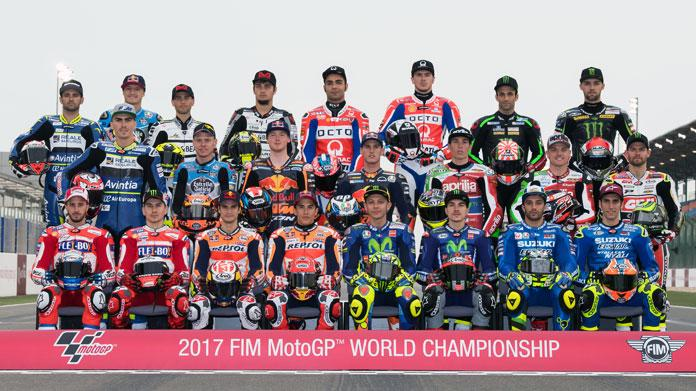

```{r setup, include=FALSE}
knitr::opts_chunk$set(echo = TRUE,message = FALSE, warning = FALSE, fig.position="H")
```
###
La MotoGP è cominciata nel 2002, sostituendo la precendente classe maggiore, la 500. Per lo studio in analisi si è deciso di escludere le prime tre edizioni della nuova classe regina poichè al tempo erano presenti sia moto con motori a due tempi sia con motori a quattro tempi, questa differenza comportava performance diverse. 
<br>
Dall'anno preso in esame (2005) non erano più presenti tali differenze poichè tutte le case costruttrici hanno adottato il motore a quattro tempi.
Inoltre nello studio non si è preso in considerazione del cambio di cilindrata che nel corso delle varie stagioni è stato richiesto dal Regolamento del Motomondiale.

L'analisi cercherà di rispondere alle seguenti domande:

1. Quale legame esiste tra una buona posizione in qualifica e il risultato in gara?
2. Come sono legate le pole position con i giri in prima posizione e i giri veloci?
3. Attraverso quali parametri si riesce a determinare il/i pilota/i migliore/i? Chi sono i piloti più forti?
4. Analisi dei piloti più forti (c.d. "big").
5. Diventare campione del mondo della MotoGP vuol dire essere realmente il pilota più forte della stagione?
6. Esiste una relazione tra la nazionalità del vincitore e l'ubicazione del circuito? C'è una relazione tra il circuito e la marca della moto vincitrice?

## 1.1 DataBase
In tale analisi sono stati utilizzati 3 dataset (denominati piloti,giri e vincitori2.0), che mettono in luce i  vari aspetti dell'analisi.

### 1.1.1 Dataset piloti
Nel dataset piloti le variabili sono le seguenti:

* *Posizione* : indica la posizione del pilota nel campionato del relativo anno.
* *Rider* : cognome del pilota. [**N.b.** Sono stati posti dei particolari caratteri per poter riconoscere piloti che hanno omonimia nel cognome].
* *Nome* : nome del pilota.
* *Punti* : punti ottenuti dal pilota nel corso di quell'edizione del mondiale.
* *Anno* : anno di rilevazione dei dati. I dati si riferiscono alle edizioni della MotoGP dal 2005 al 2017 -dati di ogni singolo anno-.
* Le successive colonne rappresentano il risultato in qualifica (*qual1*, *qual2*, ..., *qual18*) e in gara(*GARA1*, *GARA2*,...,*GARA18*) per ogni singolo circuito. 
<br>
Tuttavia si precisa che nelle varie edizioni del Motomondiale, l'ordine, il numero e i circuiti sono cambiati, pertanto non si può confrontare direttamente dal database i risultati per la medesima gara nei vari anni. Il confronto si può fare ricorrendo al sito da cui sono stati presi i dati [link](http://www.motogp.com/it/Results+Statistics).

### 1.1.2 Dataset giri
Il dataset giri descrive delle informazioni di carattere quantitativo riguardanti: 

* *Posizione*: indica la posizione del pilota nel mondiale nell'anno considerato.
* *X_1* : nome del pilota.
* *Rider* : cognome del pilota. [**N.b.** Sono stati posti dei particolari caratteri per poter riconoscere piloti che hanno omonimia nel cognome].
* *Punti* : punti ottenuti dal pilota nel corso di quell'edizione del mondiale.
* *Anno* : anno di rilevazione dei dati. I dati si riferiscono alle edizioni della MotoGP dal 2005 al 2017 -dati di ogni singolo anno-.
* *N. Vittorie*: rappresenta il numero totale di vittorie conseguite dal pilota nel corso della stagione in esame.
* *2 posti*: rappresenta il numero totale di secondi posti conseguiti dal pilota nel corso della stagione in esame.
* *3 posti*: rappresenta il numero totale di terzi posti conseguiti dal pilota nel corso della stagione in esame.
* *Giri veloci*: rappresenta il numero di giri veloci conseguiti dal pilota nel corso della stagione in esame. [Durante ogni singola gara viene assegnato il *giro veloce* ad un solo pilota che fa segnare il miglior tempo]
* *Pole*: rappresenta il numero totale di pole position conseguite dal pilota nel corso della stagione in esame. [*pole position* rappresenta il miglior tempo effettuato nelle qualifiche]
* *Giri in prima posizione*: rappresenta il numero totale di giri in prima posizione effettuati dal pilota nel corso della stagione in esame.

### 1.1.3 Dataset Vincitori2.0
Il dataset Vincitori2.0 contiene alcune informazioni riguardanti i vincitori dei Granpremi nelle diverse stagioni.
<br>
Per semplicità si è deciso di rinominare le nazionalità, il codice del circuito e la casa costruttrice con un numero evidenziati con un file apposito.
Nomenclatura <- read.csv("Nomenclatura.txt")

* *Stagione* : anno del campionato cui si riferiscono i dati.
* *Nome Circuito* : nome per esteso del circuito.
* *Sigla circuito* : sigla di riconoscimento del circuito (modificata con un numero, vedi Nomenclatura).
* *Paese* : Paese in cui si trova il circuito (modificato con un numero, vedi Nomenclatura).
* *Pilota* : cognome del pilota.[**N.b.** Sono stati posti dei particolari caratteri per poter riconoscere piloti che hanno omonimia nel cognome]
* *Nazionalità* : nazionalità del pilota (modificata con un numero, vedi Nomenclatura).
* *Costruttore* : nome della casa costruttrice con cui il pilota vince la gara (modificato con un numero, vedi Nomenclatura).

## 1.2 Library
Si riportano tutti i pacchetti che verranno utilizzati nel corso dell'analisi:
```{r}
library(dplyr)
library(tidyverse)
library(ggrepel)
library(readxl)
library(corrplot)
library(knitr)
```
## 1.3 Avvertenze
* Nel corso dello studio non tutti i piloti sono stati presi in considerazione dalla totalità delle analisi.
* I diversi Granpremi nel corso della singola stagione sono identificati con un numero progressivo.

## 1.4 Le analisi

# 1. Quale legame esiste tra una buona posizione in qualifica e il risultato in gara?

Per poter rispondere a questa domanda va caricato il dataset piloti.
<br>
```{r}
piloti <- read_excel("Dataset_piloti.xlsx")
```
Successivamente vanno sostituite le sigle presenti (NC=Not classified NL=Not finished first lap NP=Not started race re-start N2=Not finished first lap race re-start EX=Excluded NS=Not Started DS=Disqualified) con caselle con valore 0. Si precisa che chi, per qualsiasi motivo non termina la gara, ottenendo 0 punti in campionato, è come se non avesse partecipato alla gara.
```{r}
piloti[piloti=="NC"]<-0
piloti[piloti=="NL"]<-0
piloti[piloti=="EX"]<-0
piloti[piloti=="NS"]<-0
piloti[piloti=="NP"]<-0
piloti[piloti=="DS"]<-0
piloti[piloti=="N2"]<-0
piloti[is.na(piloti)]<-0
```
```{r}
#Verifica di chiave primaria
piloti%>%
  count(Rider,Anno)%>%
  filter(n>1)
```
Notiamo che questa tabella non è in formato tidy poichè abbiamo colonne che non sono variabili.
<br>
Con la funzione "gather" si ottiene una tabella stretta e molto lunga.
<br>
Viene creata quindi una colonna che rappresenta la posizione della qualifica e una per il risultato della gara.

```{r gather}
piloti2=piloti
piloti2=piloti2%>%gather('qual1', 'qual2','qual3', 'qual4','qual5','qual6', 'qual7', 'qual8', 'qual9','qual10','qual11','qual12','qual13','qual14','qual15','qual16','qual17','qual18',key="circuito", value="Qualifica")
piloti2=piloti2[,-c(6:23)]
piloti2=piloti2[,-c(3:4)]

piloti3=piloti%>%gather('GARA1', 'GARA2','GARA3', 'GARA4','GARA5','GARA6', 'GARA7', 'GARA8', 'GARA9','GARA10','GARA11','GARA12','GARA13','GARA14','GARA15','GARA16','GARA17','GARA18',key="circuito", value="risultato")
piloti3=piloti3[,-c(6:23)]
piloti3=piloti3[,-c(3:4)]

prova=piloti2%>%mutate(Risultato=piloti3$risultato)
#trasformo le colonne dal tipo character in numeric
prova[, 5] <- sapply(prova[, 5], as.numeric)
prova[, 6] <- sapply(prova[, 6], as.numeric)
```
Vengono esclusi i piloti che non partecipano alla gara ovvero quelli che hanno il valore della qualifica pari a 0. Infatti, nel corso della stagione ci possono essere piloti che partecipano solo ad alcune gare (piloti wild car) o che sostituiscono un pilota infortunato: questi piloti vengono considerati solo per le gare a cui partecipano.
```{r senza, echo=FALSE}
senza=prova%>%filter(prova$Qualifica !=0)
cor.test(senza$Qualifica,senza$Risultato)

ggplot(senza)+
  geom_point(aes(x=senza$Qualifica,y=senza$Risultato))+
  facet_wrap(~ senza$Anno, nrow=3)+
  ggtitle("Qualifica VS Risultato gara")+
  xlab("Posizione qualifica")+ylab("Risultato gara")
```
<br>

Dal risultato del coefficiente di correlazione (pari a 0.52)  si evidenzia che c'è un legame importante, ma non fondamentale, tra la posizione della qualifica rispetto al risultato della gara. Si nota che ci sono piloti che ottengono migliori risultati nel giro di qualifica rispetto a quelli conseguiti in gara.
```{r}
prova_qualgara=prova%>%filter(prova$Rider=="ROSSI"|prova$Rider=="IANNONE"|prova$Rider=="PEDROSA"|prova$Rider=="LORENZO"|prova$Rider=="MARQUEZ"|prova$Rider=="CRUTCHLOW" | prova$Rider=="ZARCO"| prova$Rider=="ESPARGARO"| prova$Rider=="VIÑALES")
prova_qualgara=prova_qualgara%>%filter(prova_qualgara$Qualifica !=0)
diff_qualgara1=mutate(prova_qualgara,diff_qualgara=(prova_qualgara$Qualifica-prova_qualgara$Risultato) )

#posizione media della qualifica
aggregate(diff_qualgara1$Qualifica~diff_qualgara1$Rider, data=diff_qualgara1, FUN =mean)
#risultato medio
aggregate(diff_qualgara1$Risultato~diff_qualgara1$Rider, data=diff_qualgara1, FUN =mean)
#differenza media tra qualifica e risultato
aggregate(diff_qualgara1$diff_qualgara~ diff_qualgara1$Rider, data = diff_qualgara1, FUN=mean)
```
<br>

## 2.Come sono legate le pole position con i giri in prima posizione e i giri veloci?

Si pensa che il pilota che effettua la pole position sia quello che abbia maggior possibilità di vincere la gara. Attraverso l'analisi seguente viene rappresentata la correlazione che intercorre tra il numero di pole position, il numero di giri veloci e il numero di giri in prima posizione.

```{r}
#carichiamo il dataset giri
giri <- read_excel("Dataset_giri.xlsx")
giri[is.na(giri)]<-0

#Verifica della chiave primaria
giri%>%
  count(Rider,Anno)%>%
  filter(n>1)
```
```{r}
#correlazione pole position, giri veloci e giri in prima posizione
s=giri[,9:11]
M<-cor(s)
col <- colorRampPalette(c("#BB4444", "#EE9988", "#FFFFFF", "#77AADD", "#4477AA"))
corrplot(M, method="color", col=col(200), type="upper", order="hclust", addCoef.col = "black", tl.col="black", tl.srt=45,diag=FALSE)
```
<br>

Si nota che i tre elementi presi in considerazione hanno un forte legame: normalmente chi effettua la pole il giorno della gara sarà uno dei favoriti per la vittoria.
Ma conoscere questo legame tra i tre elementi ci permette di affermare che un pilota risulta più forte di un altro?

## 3. Attraverso quali parametri determino il pilota più forte?

Nell'opinione comune si sostiene che il pilota più forte sia quello che riesce a vincere molto. Ma la vittoria è il parametro corretto per determinare la bravura di un corridore?

° La prima cosa da calcolare sono le frequenze di vittoria.
```{r}
n_vitto=aggregate(prova$Risultato==1 ~ prova$Rider, data = prova, sum)
n_gare=aggregate(prova$Qualifica != 0 ~ prova$Rider, data=prova, sum)

#dataset N. vittorie e N. gare disputate
df_pil_tot=data.frame(n_vitto,n_gare)
df_pil_tot=df_pil_tot[,-3]
names(df_pil_tot)[names(df_pil_tot) == "Risultato"] <- "N.Vittorie"
names(df_pil_tot)[names(df_pil_tot) == "Qualifica"] <- "N.gare disputate"
names(df_pil_tot)[names(df_pil_tot) == "prova.Rider"] <- "Rider"

#creo dataset con colonna delle frequenze (n. vittorie/n. gare disputate)
freq=mutate(df_pil_tot, freq=(df_pil_tot$N.Vittorie)/(df_pil_tot$`N.gare disputate`))
df_pil_tot2=df_pil_tot
df_pil_tot2=cbind(freq)
freq=round(df_pil_tot2$freq, digits = 2)
#dataset con frequenze arrotondate
df_pil_tot3=df_pil_tot
df_pil_tot3=cbind(df_pil_tot3,freq)
```
```{r}
#Rappresento la frequenza di vittorie
ggplot(df_pil_tot3)+
  geom_bar( aes(x=df_pil_tot3$freq),stat="count")+
  coord_flip()+
  ggtitle("N. piloti in base alle frequenze di vittorie su gare disputate")+
  xlab("Frequenza")+ ylab("N.piloti")
```
<br>

Si noti che considerati i 94 piloti che hanno partecipato ad almeno una gara in MotoGP nelle ultime tredici edizioni, molti sono quelli che non hanno ottenuto una vittoria. Vengono esclusi dall'analisi coloro che non hanno vinto, e per tanto residuano 18 piloti che vengono rappresentati con nome  e frequenza di vittoria.

```{r}
freq2=df_pil_tot3%>%filter(df_pil_tot3$freq>0)
ggplot(freq2,aes(y=freq2$N.Vittorie, x=freq2$`N.gare disputate`, col=freq2$Rider))+
  geom_point()+
  scale_x_continuous("N. gare disputate", breaks=seq(0,270, by=20))+
  scale_y_continuous("N.vittorie", breaks=seq(0,50, by=5))+
  theme_light()+
  theme(legend.position = "bottom")+
  guides(colour = guide_legend(nrow = 4, override.aes = list(size = 4)))+
  labs(colour= "Pilota")+
  labs(title="Frequenza di vittoria")+  
  ggrepel::geom_label_repel(aes(label=freq),freq2,nudge_x = 0, alpha = 1)+
  ggrepel::geom_label_repel(aes(label=Rider),freq2,nudge_y = 3, alpha = 0.5)
```
<br>

Dal grafico si può notare che ci sono piloti che hanno ottenuto molte vittorie (Rossi, Lorenzo, Pedrosa, Marquez, Stoner). Costoro si identificano come i piloti più forti?

<br>
E' bene sottolineare che le frequenze di vittoria non possono essere direttamente confrontate a causa del numero diverso di gare disputate dai diversi piloti. Quindi per decretare chi è/sono il/i pilota/i più forte/i non bisogna considerare unicamente il numero di vittorie ottenute.Allora,si analizza la posizione in campionato nei singoli anni (le stagioni sono tra di loro indipendenti).

°Da cosa dipende la posizione in campionato?

```{r Modelli, posizione dipende da}
mod1=lm(giri$Posizione~ giri$Punti+ giri$Anno+giri$`N. Vittorie`+giri$`2 posti`+
   giri$`3 posti`+giri$`Giri veloci`+giri$Pole+giri$`Giri in prima posizione`)
summary(mod1)
```
Dalle analisi si evince che la posizione in campionato è legata al punteggio, variabile a seconda dell'ordine di arrivo (file "Punteggi.txt") e i podi che il pilota ottiene.
<br>
Quindi il modello che meglio esprime il legame appena descritto è il modello 2:
```{r}
mod2=lm(giri$Posizione~ giri$Punti+giri$`N. Vittorie`+giri$`2 posti`+giri$`3 posti`)
summary(mod2)
```
Quindi per decretare la bravura di un pilota ci si limita a considerare il numero di podi. Allora, va calcolata e rappresentata la frequenza di secondi e di terzi posti. 
```{r}
n_secondi=aggregate(prova$Risultato==2 ~ prova$Rider, data = prova, sum)

df_pil_sec=data.frame(n_secondi,n_gare)
df_pil_sec=df_pil_sec[,-3]
names(df_pil_sec)[names(df_pil_sec) == "Risultato"] <- "N.secondi"
names(df_pil_sec)[names(df_pil_sec) == "Qualifica"] <- "N.gare disputate"
names(df_pil_sec)[names(df_pil_sec) == "prova.Rider"] <- "Rider"

#creo dataset con colonna delle frequenze (n.secondi/n. gare disputate)
freq2=mutate(df_pil_sec, freq2=(df_pil_sec$N.secondi)/(df_pil_sec$`N.gare disputate`))
df_pil_sec2=df_pil_sec
df_pil_sec2=cbind(freq2)
freq2=round(df_pil_sec2$freq2, digits = 2)
#dataset con frequenze arrotondate
df_pil_sec3=df_pil_sec
df_pil_sec3=cbind(df_pil_sec3,freq2)

ggplot(df_pil_sec3)+
  geom_bar( aes(x=df_pil_sec3$freq2),stat="count")+
  coord_flip()+
  ggtitle("N. piloti in base alle frequenze di secondi posti su gare disputate")+
  ylab("N. piloti")+
  scale_x_continuous("Frequenze", breaks=seq(0,1,by=0.05))
```
<br>

Ci sono 62 piloti su 94 che non hanno ottenuto mai un secondo posto.Per ottenere maggiore chiarezza, si escludono i piloti che non hanno ottenuto almeno un piazzamento sul secondo gradino del podio.

```{r}
sec2=df_pil_sec3%>%filter(df_pil_sec3$freq2>0)

ggplot(sec2,aes(y=sec2$N.secondi, x=sec2$`N.gare disputate`, col=sec2$Rider))+
  geom_point()+
  scale_x_continuous("N. gare disputate", breaks=seq(0,270, by=20))+
  scale_y_continuous("N.secondi", breaks=seq(0,50, by=5))+
  theme(legend.position = "bottom")+
  labs(colour= "Pilota")+
  labs(title="N. secondi posti VS N. gare disputate")+  
  guides(colour = guide_legend(nrow = 4, override.aes = list(size = 4)))+
  ggrepel::geom_label_repel(aes(label=sec2$Rider),sec2,nudge_y = 2, alpha = 0.4)
```
<br>

Si nota che il pilota Stoner pur avendo ottenuto diverse vittorie (32%) ha conseguito un numero limitato di secondi posti (9%) [Le percentuali sono realative al numero di gare disputate da Stoner (126)].
<br>
Si analizza la frequenza di terzi posti:

```{r}
n_terzi=aggregate(prova$Risultato==3 ~ prova$Rider, data = prova, sum)

df_pil_ter=data.frame(n_terzi,n_gare)
df_pil_ter=df_pil_ter[,-3]
names(df_pil_ter)[names(df_pil_ter) == "Risultato"] <- "N.terzi"
names(df_pil_ter)[names(df_pil_ter) == "Qualifica"] <- "N.gare disputate"
names(df_pil_ter)[names(df_pil_ter) == "prova.Rider"] <- "Rider"

freq3=mutate(df_pil_ter, freq3=(df_pil_ter$N.terzi)/(df_pil_ter$`N.gare disputate`))
df_pil_ter2=df_pil_ter
df_pil_ter2=cbind(freq3)
freq3=round(df_pil_ter2$freq3, digits = 2)
#dataset con frequenze arrotondate
df_pil_ter3=df_pil_ter
df_pil_ter3=cbind(df_pil_ter3,freq3)

ggplot(df_pil_ter3)+
  geom_bar( aes(x=df_pil_ter3$freq3),stat="count")+
  coord_flip()+
  ggtitle("N. piloti in base alle frequenze di terzi posti su gare disputate")+
  ylab("N. piloti")+
  scale_x_continuous("Frequenze", breaks=seq(0,1,by=0.05))
```
```{r}
ter2=df_pil_ter3%>%filter(df_pil_ter3$freq3>0)

ggplot(ter2,aes(y=ter2$N.terzi, x=ter2$`N.gare disputate`, col=ter2$Rider))+
  geom_point()+
  scale_x_continuous("N. gare disputate", breaks=seq(0,270, by=20))+
  scale_y_continuous("N.terzi", breaks=seq(0,50, by=5))+
  theme(legend.position = "bottom")+
  labs(colour= "Pilota")+
  labs(title="N. terzi posti VS N. gare disputate")+  
  guides(colour = guide_legend(nrow = 4, override.aes = list(size = 4)))+
  ggrepel::geom_label_repel(aes(label=ter2$Rider),ter2,nudge_y = 2, alpha = 0.4)
```
<br>
Si trova che 28 piloti su 94 presenti nelle diverse edizioni del Mondiale hanno ottenuto almeno un terzo posto con frequenze tra di loro diverse.
<br>
Per esempio il pilota Nicky Hayden nell'intervallo di tempo considerato nell'analisi (dal 2005 al 2017) ha ottenuto 15 terzi posti di cui 5 nell'anno 2006 in cui è diventato campione del mondo pur limitandosi a solo due primi posti. Al contrario nella stessa stagione (2006) Valentino Rossi che ha totalizzato lo stesso numero di podi con cinque vittorie termina il campionato in seconda posizione.
<br>
Per sottolineare l'importanza dei piazzamenti e non unicamente della vittoria, anche il pilota Jack Miller pur avendo vinto una gara nella stagione 2016 ha concluso il campionato in 18° posizione.
```{r}
prova%>%filter(prova$Risultato==1, prova$Rider=="MILLER")
```
Per completare l'analisi è stata analizzata la correlazione tra posizione in campionato e il numero di giri in prima posizione.

```{r}
cor.test(giri$Posizione, giri$`Giri in prima posizione`) 
```
Viene dimostrato che c'è correlazione negativa tra giri in prima posizione e posizione in campionato (-0.538), ovvero colui che è in coda alla classifica effettua pochi/ nessun giro in testa, benchè chi risulta il vincitore del campionato non neecessariamente realizza il maggior numero di giri in prima posizione, come si evidenzia nei grafici seguenti.

```{r} 
gir_pri_1=giri%>%filter(giri$`Giri in prima posizione`>=1)
ggplot(data=gir_pri_1)+
  geom_point(aes(x=gir_pri_1$Anno,y=gir_pri_1$`Giri in prima posizione`, 
                 col=factor(gir_pri_1$Posizione)),size=2)+
  scale_y_continuous("N.giri prima posizione", breaks=seq(0,300, by=20))+
  scale_x_continuous("Anno", breaks=seq(2005,2017, by=2))+
  theme(legend.position = "bottom") +
  guides(colour = guide_legend(nrow = 3, override.aes = list(size = 4)))+
  labs(title="Giri in prima posizione")+
  labs(col="Posizione")
```
<br>
Per maggiore chiarezza sono stati esclusi i piloti che in ciascun anno hanno effettuato meno di 20 giri in prima posizione.

```{r}
gir_pri_20=giri%>%filter(giri$`Giri in prima posizione`>=20)
ggplot(data=gir_pri_20)+
  geom_point(aes(x=gir_pri_20$Anno,y=gir_pri_20$`Giri in prima posizione`, 
                 col=factor(gir_pri_20$Posizione)),size=2)+
  scale_y_continuous("N. giri prima posizione ", breaks=seq(0,300, by=20))+
  scale_x_continuous("Anno", breaks=seq(2005,2017, by=2))+
  theme(legend.position = "bottom") +
  guides(colour = guide_legend(nrow = 3, override.aes = list(size = 4)))+
  labs(title="Giri in prima posizione per anno")+
  labs(col="Posizione")
```
```{r}
cor.test(giri$Posizione, giri$`Giri veloci`) 
```
Analogamente esiste correlazione negativa tra la posizione in campionato e il numero di giri veloci.
<br>
Considerando le analisi precedenti si può dimostrare che i piloti che hanno ottenuto la maggior frequenza di piazzamenti sul podio (definibili come "big") sono i seguenti:

```{r results="asis"}
Rider=c("Jorge Lorenzo","Marc Marquez","Dani Pedrosa","Valentino Rossi","Casey Stoner")
fvitto=c(0.25,0.39,0.15,0.21,0.32)
f2p=c(0.25,0.21,0.20,0.19,0.09)
f3p=c(0.13,0.10,0.21,0.16,0.17)
tot_percentuale=c(63,70,55,56,58)
tot_gare=c(175,90,202,226,118)
dati=data.frame(Rider,fvitto,f2p,f3p,tot_percentuale,tot_gare)
knitr::kable(dati[,], caption="I big")
```
<br>

## 4. Analisi sui big
Dal dataset piloti estraiamo i 5 piloti che abbiamo definito come big:
```{r Posizioni del campionato dei big}
piloti_big=piloti%>%filter(piloti$Rider=="ROSSI"| piloti$Rider=="LORENZO"| piloti$Rider=="STONER"| piloti$Rider=="PEDROSA"| piloti$Rider=="MARQUEZ")
ggplot(piloti_big,aes(x=piloti_big$Anno,y=piloti_big$Posizione, col=piloti_big$Rider))+
  geom_point()+
  geom_line()+
  scale_y_continuous("Posizione in campionato ", breaks=seq(0,10, by=1))+
  scale_x_continuous("Anno", breaks=seq(2005,2017, by=2))+
  labs(title="Posizione in campionato dei big nei vari anni", col="Rider")
```
```{r}
giri_big=giri%>%filter(giri$Rider=="ROSSI"| giri$Rider=="LORENZO"| giri$Rider=="STONER"| giri$Rider=="PEDROSA"| giri$Rider=="MARQUEZ")
```
```{r Giri 1°posizione tenendo conto della posizione in campionato}
ggplot(giri_big,aes(x=giri_big$Anno,y=giri_big$`Giri in prima posizione`, col=giri_big$Rider))+
  geom_point()+
  geom_line()+
  scale_y_continuous("N.Giri in prima posizione ", breaks=seq(0,300, by=20))+
  theme_light()+
  scale_x_continuous("Anno", breaks=seq(2005,2017, by=2))+
  labs(title="N. giri in prima posizione dei big nei vari anni", col="Rider")+
   ggrepel::geom_label_repel(aes(label=giri_big$Posizione),giri_big,nudge_y = 2, alpha = 0.6)
```
<br>
Tra i big si evince che chi effettua tanti giri in prima posizione tendenzialmente ricopre una posizione prestigiosa in campionato.

```{r veloci tenendo conto della posizione in campionato}
ggplot(giri_big,aes(x=giri_big$Anno,y=giri_big$`Giri veloci`, col=giri_big$Rider))+
  geom_point()+
  geom_line()+
  scale_y_continuous("N.giri veloci", breaks=seq(0,16, by=2))+
  theme_light()+
  scale_x_continuous("Anno", breaks=seq(2005,2017, by=2))+
  labs(title="N. giri veloci dei big nei vari anni", col="Rider")+
   ggrepel::geom_label_repel(aes(label=giri_big$Posizione),giri_big,nudge_y = 0.5, alpha = 0.6)
```
<br>
Attraverso il grafico viene dimostrata la tesi che il numero di giri veloci non è legata alla posizione in classifica: infatti si può notare che nel 2008 Stoner arrivato secondo in classifica campionato, ha fatto quasi il doppio (9) di giri veloci rispetto a Rossi (5 giri veloci) che ha vinto il campionato.

```{r N.Vittorie tenendo conto della posizione in campionato}
ggplot(giri_big,aes(x=giri_big$Anno,y=giri_big$`N. Vittorie`, col=giri_big$Rider))+
  geom_point()+
  geom_line()+
  scale_y_continuous("N.Vittorie ", breaks=seq(0,14, by=2))+
  theme_light()+
  scale_x_continuous("Anno", breaks=seq(2005,2017, by=2))+
  labs(title="N. vittorie dei big nei vari anni", col="Rider")+
  ggrepel::geom_label_repel(aes(label=giri_big$Posizione),giri_big,nudge_y = 2, alpha = 0.6)
```
<br>
Dopo questo grafico viene sottolineato che il più forte non è colui che effettua il più alto numero di vittorie, infatti nel 2012 e nel 2013 il vice campione del mondo ha ottenuto un numero maggiore di primi posti rispetto al primo in classifica.
<br>

## 5. Diventare campione del mondo della MotoGP vuol dire essere realmente il pilota più forte della stagione?
Attraverso l'analisi è stato dimostrato che un pilota viene definito "forte" se ottiene dei buoni piazzamenti sul podio. Con questa ultima analisi si metteranno in relazione i piazzamenti del campione e del vice campione di ogni stagione.

```{r correlazione qualifica-risultato}
#correlazione qualifica- risultato gara per i campioni
q=prova%>%filter(prova$Posizione==1)
q[, 5] <- sapply(q[, 5], as.numeric)
q[, 6] <- sapply(q[, 6], as.numeric)
qsenza=q%>%filter(q$Qualifica !=0)
cor.test(qsenza$Qualifica,qsenza$Risultato)

#relazione generale qualifica-risultato
ggplot(data=qsenza)+
  geom_point(aes(x=qsenza$Qualifica,y=qsenza$Risultato),position = "jitter")+
  scale_x_continuous("Posizione qualifica",breaks=seq(1,20,by=2))+
  scale_y_continuous("Risultato gara",breaks=seq(0,20,by=2))+
  labs(title="Qualifica VS Risultato gara campioni del mondo")
```
<br>
La nuvola di punti in basso a sinistra rende evidente che il campione del mondo normalmente consegue buone qualifiche e realizza dei buoni piazzamenti.
```{r}
#relazione qualifica-risultato specifica per anno
  ggplot(data=qsenza,aes(x=qsenza$Qualifica,y=qsenza$Risultato))+
    geom_point( position="jitter")+
    scale_y_continuous("Risultato gara", breaks=seq(0,20, by=2))+
    scale_x_continuous("Posizione qualifica", breaks=seq(1,25,by=2))+
    labs(title="Qualifica VS Risultato gara")+
    facet_wrap(~ qsenza$Anno, ncol=7)
```
<br>
Tuttavia nell'arco del campionato il campione del mondo può avere significative discrepanze di posizionamenti (barra lunga) rispetto ai risultati del secondo in campionato (pallini).
```{r piazzamenti} 
vice=prova%>%filter(prova$Posizione==2)
vice[, 5] <- sapply(vice[, 5], as.numeric)
vice[, 6] <- sapply(vice[, 6], as.numeric)

#Diversità piazzamenti campione e vice campione del mondo
ggplot()+
  geom_line(aes(x=q$Anno,y=q$Risultato, col=q$Rider))+
  geom_point(aes(x=vice$Anno,y=vice$Risultato),alpha=0.2, col="red")+
  scale_x_continuous("Anno", breaks=seq(2005,2017,by=2))+
  scale_y_continuous("Posizionamenti", breaks=seq(0,16,by=2))+
  labs(title="Diversità posizionamenti campione e vice campione nella stagione",subtitle="linea=campione, puntini=vice campione" ,col="Rider")
```
<br>

In diversi anni si nota che il vice campione del mondo pur avendo ottenuto dei risultati maggiormente concentrati in determinate posizioni rispetto al primo in classifica, non è riuscito a distinguersi e ottenere la vittoria del campionato.
```{r}
giri_c_v=giri%>%filter(giri$Posizione==1| giri$Posizione==2)
ggplot()+
  geom_point(aes(x=giri_c_v$Anno,y=giri_c_v$Punti),col=giri_c_v$Posizione)+
  scale_x_continuous("Anno", breaks=seq(2005,2017,by=2))+
  scale_y_continuous("Punti", breaks=seq(0,400,by=25))+
  labs(title="Differenza punti campione e vice campione", subtitle="nero=campione del mondo, rosso=vice campione del mondo")
ggplot()+
  geom_point(aes(x=giri_c_v$Anno,y=giri_c_v$`N. Vittorie`),col=giri_c_v$Posizione,shape=3)+
  geom_point(aes(x=giri_c_v$Anno,y=giri_c_v$`2 posti`), col=giri_c_v$Posizione, shape=2)+
  geom_point(aes(x=giri_c_v$Anno,y=giri_c_v$`3 posti`), col=giri_c_v$Posizione)+
  scale_x_continuous("Anno", breaks=seq(2005,2017,by=2))+
  scale_y_continuous("N. risultati", breaks=seq(0,16,by=1))+
  theme_light()+
  labs(title="Numero di piazzamenti podio campione e vice campione", subtitle="+=vittorie, triangolo=2°posti, pallino=3°posto, nero=campione, rosso=vice campione")
```
<br>

## 6. Esiste una relazione tra la nazionalità del vincitore e il circuito? C'è una relazione tra il circuito e la marca della moto vincitrice?
<br>
Per poter rispondere alla domanda va caricato il dataset vincitori2.0.
```{r}
vincitori2 <- read_excel("Dataset_vincitori2.0.xlsx")
```
<br>
Nel dataset viene escluso il nome esteso del circuito (colonna 2) che ripete l'informazione contenuta nella sigla univoca del circuito (colonna 3).
La sigla identificativa è stata tradotta con un valore numerico (vedi "Nomenclatura.txt").

```{r}
vincitori2=vincitori2[,-2]
```
```{r}
#Verifica della chiave primaria
vincitori2%>%
  count(Stagione, `Sigla circuito`)%>%
  filter(n>1)
```
° C'è relazione tra la nazionalità del vincitore e il luogo in cui è ubicata la gara?
```{r}
cor.test(vincitori2$Paese, vincitori2$Nazionalità)
```
Si nota che le due variabili risultano indipendenti, anche perchè le gare del Motomondiale vengono disputate in vari Paesi del mondo mentre le nazionalità dei piloti vincitori sono poche, principalmente risultano Spagnoli, Italiani, Australiani ed Americani.

°C'è relazione tra costruttore e circuito?

```{r}
#_vitto=aggregate(prova$Risultato==1 ~ prova$Rider, data = prova, sum)
honda=aggregate(vincitori2$Costruttore==1~vincitori2$`Sigla circuito`, data = vincitori2, sum)
ducati=aggregate(vincitori2$Costruttore==2~vincitori2$`Sigla circuito`, data = vincitori2, sum)
suzuki=aggregate(vincitori2$Costruttore==3~vincitori2$`Sigla circuito`, data = vincitori2, sum)
yamaha=aggregate(vincitori2$Costruttore==4~vincitori2$`Sigla circuito`, data = vincitori2, sum)
f_vitto_h=sum(honda$`vincitori2$Costruttore == 1`)/230
f_vitto_d=sum(ducati$`vincitori2$Costruttore == 2`)/230
f_vitto_s=sum(suzuki$`vincitori2$Costruttore == 3`)/230
f_vitto_y=sum(yamaha$`vincitori2$Costruttore == 4`)/230
freq_casa=data.frame(f_vitto_h,f_vitto_d, f_vitto_s, f_vitto_y)
freq_casa=freq_casa%>%gather('f_vitto_h','f_vitto_d','f_vitto_s','f_vitto_y',key="Case", value="Frequenze")
ggplot()+
  geom_bar(aes(x=freq_casa$Case, y=freq_casa$Frequenze),stat="identity")+
  labs(title="Frequenza vittorie casa costruttore")+
  xlab("Costruttore")+ ylab("Frequenze")
```
<br>
E' da tenere presente che la frequenza di vittoria della casa costruttrice "Suzuki" non è possibile confrontarla con le altre, poichè per alcune stagioni (2012,2013 e 2014) non ha preso parte al Motomondiale.
```{r}
cor.test(vincitori2$Costruttore,vincitori2$`Sigla circuito`)
```
Pur considerando la sostanziale identità dei circuiti in cui si svolgono le gare del campionato, non è possibile provare una relazione tra costruttore e circuito.

```{r}
f_case_tot=honda%>%mutate(N_Ducati=ducati$`vincitori2$Costruttore == 2`)
f_case_tot=f_case_tot%>%mutate(N_Suzuki=suzuki$`vincitori2$Costruttore == 3`)
f_case_tot=f_case_tot%>%mutate(N_Yamaha=yamaha$`vincitori2$Costruttore == 4`)
f_case_tot=f_case_tot%>%mutate(N_Honda=honda$`vincitori2$Costruttore == 1`)
names(f_case_tot)[names(f_case_tot)=="vincitori2$`Sigla circuito`"]<- "Sigla"
f_case_tot=f_case_tot[,-2]
```
**N.b.** 
L'ordine dei circuiti considerato nei grafici seguenti segue l'ordine delle gare della stagione 2017.
<br>
Inoltre i circuiti identificati con i numeri dal 19 al 24 rappresentano piste in cui nell'ultimo anno non si è corso.

```{r}
ggplot()+
  geom_line(aes(x=f_case_tot$Sigla,y=f_case_tot$N_Yamaha),col=4)+
  geom_point(aes(x=f_case_tot$Sigla,y=f_case_tot$N_Yamaha),col=4)+
  geom_line(aes(x=f_case_tot$Sigla,y=f_case_tot$N_Ducati),col=2)+
  geom_point(aes(x=f_case_tot$Sigla,y=f_case_tot$N_Ducati),col=2)+
  geom_line(aes(x=f_case_tot$Sigla,y=f_case_tot$N_Suzuki),col=3)+
  geom_point(aes(x=f_case_tot$Sigla,y=f_case_tot$N_Suzuki),col=3)+
  geom_line(aes(x=f_case_tot$Sigla, y=f_case_tot$N_Honda),col=1)+
  geom_point(aes(x=f_case_tot$Sigla, y=f_case_tot$N_Honda),col=1)+
  scale_x_continuous("Sigla circuito", breaks=seq(1,24,by=1))+
  scale_y_continuous("N.vittorie", breaks=seq(0,12,by=1))+
  theme_light()+
  labs(title="N. vittorie per casa costruttrice per singolo circuito", subtitle="Blu=Yamaha, Rosso=Ducati, Verde=Suzuki, Nero=Honda")
```
```{r}
ggplot()+
  geom_point(aes(x=vincitori2$`Sigla circuito`,y=vincitori2$Stagione),col=vincitori2$Costruttore,size=2)+
  scale_x_continuous("Sigla circuito", breaks=seq(1,23,by=1))+
  scale_y_continuous("Anno", breaks=seq(2005,2017,by=2))+
  theme_light()+
  labs(title="Andamento vittorie per circuito", subtitle="Blu=Yamaha, Rosso=Ducati, Verde=Suzuki, Nero=Honda")
```
<br>
Osservando i dati emerge che in certe piste c'è un predominio di una determinata casa costruttrice che continua da diverse stagioni, come si può notare per quanto riguarda Honda nel circuito 3 e 9. Questo predominio di una scuderia può essere legato a molti fattori, quali:
<br>
1. Le caratteristiche del tracciato (es.la pista ha lunghi rettilinei, curve particolari, o sul medesimo lato).
<br>
2. La capacità di interpretazione del circuito da parte del pilota.

## 1.5 Conclusioni

In conclusione attraverso lo studio si è scoperto che tra qualifica e risultato della gara c'è un  legame: la buona posizione in qualifica influisce sul risultato della gara. Tuttavia si è notato che il pilota candidato a vincere il campionato non può basarsi unicamente sul numero di vittorie che  ottiene, ma  deve collezionare una serie rilevante di piazzamenti sul podio.
<br>
L'ottenimento di diversi buoni risultati determina la posizione in campionato del pilota ma essa non è legata al numero di giri che effettua in prima posizione, o al numero di giri veloci o alle pole position che ottiene, anche se questi tre elementi sono tra di loro fortemente legati. Infatti, non necessariamente il primo in classifica risulta colui che effettua il maggior numero di giri in prima posizione, o il maggior numero di giri veloci. La rilevanza dei piazzamenti sul podio si riscontra anche quando si confrontano i risultati del campione e del vice campione del mondo.
<br>
Risulta ininfluente la relazione intercorrente tra la nazionalità del pilota vincitore e l'ubicazione del circuito: si è scoperto che questa non sussiste perchè le gare del Motomondiale vengono svolte in diversi continenti mentre le nazionalità dei piloti sono limitate. Al contrario  si è riscontrato che in certe piste c'è il predominio di una casa costruttrice che trova il circuito più congegnale alle caratteristiche della moto e/o del pilota.
<br>
Pertanto,
<br>
> l'importante non è vincere ma partecipare! (Pierre de Coubertin)

```{r pressure, echo=FALSE, fig.cap="A caption", out.width = '100%'}

```

